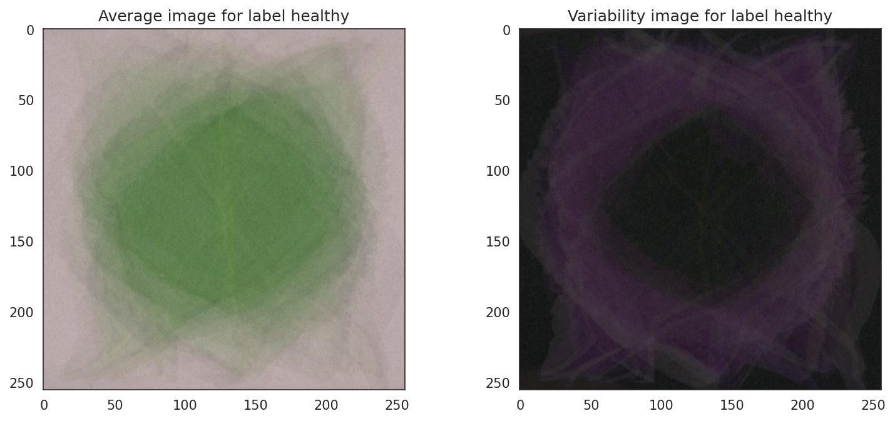
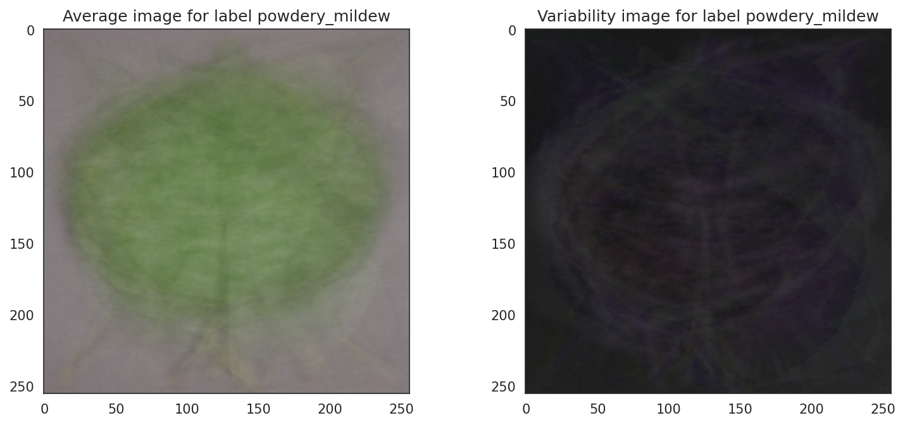

### Powdery mildew predictor

#### Introduction

Powdery mildew is a fungal infection that affects a wide range of plants, including the cherry plant. Infection with powdery mildew can cause a white or grayish coating on the leaves of infected plants and sometimes the fruit. The fungus spreads through airborne spores and thrives in humid conditions.
Infection of plants with powdery mildew can negatively affect the overall functioning of the plant, including disrupting photosynthesis. This can result in stunting of growth of the plant as well as overall quality and yield of the fruit.

Powdery mildew can spread easily between infected plants via physical contact with infected plants or fungal airborne spores. Therefore, early detection of powdery mildew infection is vital to preserve the overall quality of the crop.

Our client, a cherry farmer, is interested in creating a tool to accurately detect whether a cherry leaf is infected with powdery mildew or not in order to allow effective infection monitoring of their crops.

We have developed a machine learning tool to predict whether a cherry leaf is infected with powdery mildew or not. The tool has been deployed and can be accessed by following this [link](https://powdery-mildew-predictor-1becb7613bb9.herokuapp.com/).

We followed the Cross-industry Standard process for Data-Mining (CRISP-DM) structure frameworks to guide our steps involved in this machine learning project.

### Business case / understanding

Our client is a cherry farmer who has been having issues with their cherry crops being infected with the fungus, Powdery Mildew. Their farm employees spend approximately 30 minutes per cherry tree checking if the leaves show signs of infection. As this is a strain on the time resources of the employees and infection of the cherry tree with powdery mildew can impact the quality and yield of the product, the client would like to explore more time-effective methods to determine whether cherry leaves are infected with powdery mildew or not.

The business requirements are:

1. The client would like us to conduct a study to visually differentiate between a cherry plant infected with powdery mildew and one that is not.
2. The client would like to be able to detect whether a cherry leaf is infected with powdery mildew or not.

The business case can be broken down into the user stories discussed in this section. Note: User stories were separated into MUST HAVE, SHOULD HAVE, COULD HAVE AND SHOULDN'T HAVE. All user stories labelled as SHOULD HAVE were completed. Additionally, there were a number of users stores that were directed at the Machine learning (ML) scientists perspective, these along with the client-side user stories are available to view in the following [Github board](https://github.com/users/BGCG/projects/7/views/1)

**Client user stories**

* As a client, I can see a study comparing the leaves infected with powdery mildew or not so I can see if there are any discriminatory features between the two groups (SHOULD HAVE)
* As a client, I can make live predictions on cherry leaf images so I can accurately detect whether they have powdery mildew or not (SHOULD HAVE)
* As a client, I can download a report so I can easily have a summary of the prediction probability result of each leaf so I can use this for the infection monitoring of my farm (SHOULD HAVE)
* As a client, I want to evaluate the model performance by seeing a summary of the performance of the model on test set data so I can determine whether the study has met my business requirements (SHOULD HAVE)

There were a number of COULD HAVE and SHOULDN'T HAVE user stores that were not completed for the reasons outlined below:

* As a client, I can share my prediction results easily so I can give access to the data to my other colleagues (SHOULDN'T HAVE).

Reason for non-completion: This user story was not completed due to data privacy concerns, for example if the data could be accidentally shared by anyone who had access to the link, this might break the NDA agreement.

* As a client, I can provide feedback to the ML scientists via the dashboard so I can inform the model creators of any improvements that could be made to the ML tool (COULD HAVE) && As a client, I can view how the model generalises to data over time so I can monitor the model performance over a long period (COULD HAVE).

Reason for non-completion: These users stories would be very effective for the monitoring stage of the CRISP-DM process as it would provide an easy feedback contact portal to the ML scientist and provide a history of all the live predictions so the farmers could compare these results with crop outcomes (i.e. cherry fruit quality). These user stories were not completed as it was outside the scope of this educational project.

* As a client, I can report any technical issue with the dashboard so I can easily inform the developers of any bugs in the dashboard (COULD HAVE).

Reason for non-completion: This user story was not completed due to time constraints but I believe would enhance the user experience and provide an effective way to monitor the dashboard.

### Dataset composition

The dataset consisted of 2104 images of cherry leaves that were infected with powdery mildew and 2104 images of cherry leaves that were healthy. The dataset was downloaded from [Kaggle](https://www.kaggle.com/datasets/codeinstitute/cherry-leaves).

### Data preparation

Non-image files from cherry leaves image dataset were removed and image files were split the images into train, validation and test in a 7:1:2 ratio.

### Rationale to map the business requirements to the Data Visualizations and ML tasks

Business requirement 1: **The client would like us to conduct a study to visually differentiate between a cherry plant infected with powdery mildew and one that is not.**

Business requirement 1 maps to the following user story: As a client, I can see a study comparing the leaves infected with powdery mildew or not so I can see if there are any discriminatory features between the two groups

We will tackle this user story by performing a study to determine whether we can visually differentiate a leaf infected with powdery mildew and one not infected with powdery mildew. This will allow us to determine whether the powdery  mildew can cause visual difference in the cherry leaves and also will give us a clue to whether the client's request of developing a tool to detect powdery mildew in cherry leaves can be solved by image analysis alone.

Business requirement 2: **The client would like to detect whether a cherry leaf has powdery mildew or not.**

Business requirement 2 maps to the following user stories:

* As a client, I can make live predictions on cherry leaf images so I can accurately detect whether they have powdery mildew or not
* As a client, I can download a report so I can easily have a summary of the prediction probability result of each leaf so I can use this for the infection monitoring of my farm
* As a client, I want to evaluate the model performance by seeing a summary of the performance of the model on test set data so I can determine whether the study has met my business requirements

I will tackle these user stories by creating a binary classification model which can accurately detect whether a cherry leaf is infected with powdery mildew or not by detecting patterns in the leaves with powdery mildew that are distinct from those that are healthy. I will create a dashboard where the client can view the model performance on test data. Additionally, I will ensure there is a functionality on the dashboard where the client can upload an image or multiple images of cherry leaves where they can

### ML business case

**Problem statement:** Our client, who is a cherry farmer, needs to monitor the infection of their crop of powdery mildew as this affects the quality and yield of the fruit. Currently, a farm employee spends around 30 minutes on each tree to determine whether a cherry tree is infected with powdery mildew. As this is a time-expensive approach, the client wants a faster method to determine whether a tree is infected with powdery mildew.

**Outcomes:** Our outcomes are to develop a faster and more effective method for our client to detect powdery mildew in their crop.

**Approach:** Initial data visualisation studies determined that although we could detect visual difference between leaves infected in powdery mildew or not, when we plotted the difference between the powdery mildew and healthy images, we could not see a large difference. Therefore, we decided to create a binary classification model to determine whether a leaf from a cherry tree is infected with powdery mildew or not. We used a dataset from Kaggle containing 2104 images of cherry leaves that were infected with powdery mildew and 2104 images of cherry leaves that were healthy to train our model. The model training and our hypotheses and validation will be described below.

### Modeling

#### Model building

With the knowledge gained from our data visualisation study and our exploration of regularisation techniques and different hyperparameters, we constructed a high performance model for predicting whether a leaf is infected in powdery mildew or not. The model architecture is described below:

##### Model basic architecture

* `Sequential` model blueprint for building the neural network into a linear sequence of layers.
* `input layer` initial layer when data is put into the network for processing, the expected image shape was specified here - (256, 256, 3).
* `hidden layers` where the information is processed from the input data where the features and patterns are extracted.
* `fully connected layer` where every neuron is linked to every neuron in the previous and subsequent layers
* `output layers` is the layer where the decision making happens - where the final predictions are based on the patterns and features learnt in the hidden layers during training.

##### Model key features

* `Conv2D` layers for feature extraction by acting as a small matrix that scans over an input image, carrying out convolution actions to extract features from the image.
* `ReLU` activation functions to selectively activate or deactivate neurons based on the nature of the signals received.
* `Maxpooling` layer here a sliding window (2x2) migrates across the input feature map and at each position selects the maximum within the window and places it in the output, while others are disposed. This process captures the most notable features such as patterns and textures.
A dropout layer in the hidden layer to temporarily deactivate a number of randomly selected neurons in the hidden layers by setting their outputs to zero. This was introduced to reduce overfitting by preventing the network from depending on any single neuron during training.
* `Sigmoid` activation in the output layer to introduce non-linearity to enable the network to model complex relations to make predictions.
* `Adam` optimiser which utilises a combination of adaptive learning rates with momentum
* `binary_crossentropy` quantifies the ability of the model’s predicted probability to match the binary labels.

##### Performance metrics

* Accuracy - a measure of the 'correctness' of the prediction of the model. It is calculated by dividing the number of correct predictions by the total number of predictions.
* Loss - used to determine the inaccuracy of the model's predictions in comparison to the actual values.

#### Model Evaluation and hypothesis validation summary

Careful construction of the model with the help of regularisation techniques (internal dropout and image augmentation) and usage of the `adam` optimiser resulted in a model that predicted the correct labels with an accuracy of 99.2% while performing the test set evaluation.

Evaluation of the model performance on the test set of data are shown below:

In summary, the study showed that the model could make highly accurate predictions on test data (accuracy score of 99.2%), confirming we have met our business requirements for the client. I will describe the process of optimising the model below.

#### Hypothesis and validation

###### Hypothesis 1: Cherry leaves infected with powdery mildew can be visually distinguished from those that are not infected

Validation: As per the clients requests, we carried our study to see if a cherry leaf was infected with powdery mildew and those that are not, to determine whether there are any visual differences between the two groups. Plotting of an image montage showed that cherry leaves infected with powdery mildew showed that those affected with powdery mildew had white blemishes in the middle of the leaf and the leaf had a shriveled appearance.

Analysis of the average images and variability images in powdery mildew and unaffected leaves showed again that powdery mildews had more white stripes in the middle and inside the leaf body.

However, the difference between the average infected leaf and noninfected leaf showed no clear differences between the two groups. This confirmed that this problem can’t be solved with data analytics alone and that we require a more complex tool to allow us to distinguish between a leaf infected with powdery mildew and one that is not.

###### Hypothesis 2: Providing a dropout layer in the hidden layer of the network improve prediction accuracy

In our initial work, we created a basic model as described in the 'Model Basic Architecture' and 'Model Key Features' except for intially we did not have an internal dropout layers in it and later performed some hyperparameter optimisation (specifically with deciding which optimiser to use) as described in the remainder of this section. Our final model's performance was best when using a combination of regluarisation techniques and different hyperparameters, therefore we will present a table comparing the different models performance when using different parameters and regualarisation techniques at the end of the hypothesis and validation section.

Validation: When evaluating the test data on the basic model, the accuracy score reduced to 98%. Although this performance was very good, we wanted to ensure that the model was robust when exposed to a variety of different image data. Therefore, in order to make the job harder to learn from the train data to provide a more steady but accurate pace of learning, I decided to put in a dropout layer in the hidden layer to deactivate a randomly set of neurons to improve the network’s generalisation ability. I trained the new adapted model on the train set and then evaluated its performance on the test set. This in combination with other regularisation techniques (such as image augmentation) resulted in an accuracy score of 99.2% when the model was evaluated on test data.

###### Hypothesis 3: Adjusting the height and width shift range will improve model performance on test set

Validation: To further address the issue of the model not being to generalise well enough on test data, I also decided to augment the images to make it more challenging for the model to find patterns while training to ultimately make the model more robust. This exposed the model to different scenarios and would improve its robustness in real world citation, i.e. say in future if the farmer had some images where part of the leaf was not present in the full image. If the model wasn’t prepared for images with reduced information, the model could make inaccurate predictions. I achieved this by setting setting the height and width shift range from 0.1 to 0.2 in the image augmentation parameters custom function and then apply these augmentation to the train set images contributed to an increase in model performance when performing the binary classification task as this could result in parts of the leaf in the image to be cut off and therefore making the data more challenging for the network to learn patterns from.

##### Hypothesis 4: Usage of the adam optimiser over adagrad optimiser improves model performance

Validation: We initially explored the usage of different optimisers to determine what would lead to the best performance, while also reducing the change of overfitting. We initially explored the `adagrad` optimiser to address concerns about model overfitting as we noticed that the validation accuracy was consistently performing better than the train accuracy at each Epoch.  Usage of the `adagrad` optimiser results in a slow and steady increase in accuracy score but ultimately when the data was exposed to the test set, the accuracy dropped to 97%. However, following these findings we decided it would be best to explore different optimisers. The `adam` optimiser is popular as it utilises a combination of adaptive learning rates with momentum which can result in higher learning rates. However, increased learning rates in training does not necessarily mean that there is better model performance on test data. Therefore, we found usage of the regularisation techniques outlined above (dropout and image augmentation) to challenge the model, in addition to usage of the `adam` optimiser resulted in an increased accuracy score (99.2%) when evaluating the model performance on the test set.

In summary, the study showed that the model could make highly accurate predictions on test data (accuracy score of 99.2%), confirming we have met our business requirements for the client.

### Deployment phase - dashboard implementation and features

* Streamlit was used to build the dashboard which is an open-source python library allowing the timely creation of web apps.
* The dashboard provides an interactive interface allowing the client to view the results of the study and use the machine learning tool.
* The app has an interactive navigation panel, allowing the client to easily navigate between the pages.

#### Project summary page

* On the project summary page there is some background information about the issue at hand, information about the structure of the dataset and the business requirements.
* Additionally, there is a link to the README file for this project, in case the client would like any additional information.

#### Leaf visualiser page

* When the user clicks the ‘Leaf visualiser’ in the menu, the Leaf visualiser page will appear.
* When the 'difference between average and variability image' is checked the average and variability image is displayed.

* When the 'difference between powdery mildew and healthy leaves' is checked, the difference between the groups images is displayed, allowing the client to observe if there are any differences between the average images between groups.

* When 'healthy' or 'powdery mildew' is selected and 'create montage' is clicked, then an image montage of the healthy or powdery mildew is created and displayed, allowing the client to view a subset of the images in either group.

* The features described on this page tackles the 'As a client, I can see a study comparing the leaves infected with powdery mildew or not so I can see if there are any discriminatory features between the two groups' user story.

#### Project hypothesis page

* If the user clicks ‘Project hypothesis’ in the navigation bar, a page containing text explaining the project hypothesis will appear.

#### ML performance

* When the user clicks on the ‘ML performance’ option on the navigation menu, a page outlining the performance on the machine learning product will be displayed.
* Firstly a plot of the frequency of samples in healthy and powdery mildew groups, as well as the proportion assigned to training, test and validation groups.

* Below that is loss and then the accuracy values plotting at each epoch/iteration during the models training.
Then a confusion matrix which shows all the true positives, true negatives, false positives and false negatives - giving a detailed overview of the model performance on the test set.

* The history plots are followed by the precision-recall plots and ROC plot, which show that the model performed well on test data.
* Underneath each plot is some descriptive text, describing the purpose of the plot and the findings gleaned from the figure.

* Then there is a table containing the evaluation metrics of loss and accuracy when the test set was applied to the model.

* The 'ML performance' page tackles the 'As a client, I want to evaluate the model performance by seeing a summary of the performance of the model on test set data so I can determine whether the study has met my business requirements' user story.

#### Live powdery mildew predictor

* When the user clicks on the ‘Live powdery mildew predictor’ option on the navigation menu, a page inviting the user to upload an image is displayed.

* The user can upload an image of a cherry leaf and then the tool will display the image on the page, display a figure plotting the prediction probability for each label and also a report including the image name and the predicted class.

* The user can then download the report, by clicking ‘Download report’ where the report will be downloaded to the user's local computer.
  

* The user can upload multiple images, to perform predictions on several images and if the user downloads the report, the user will display a new row of a predicted label for the different images.
* The feature presented on the 'Live powdery mildew predictor page' tackles the 'As a client, I can make live predictions on cherry leaf images so I can accurately detect whether they have powdery mildew or not' and the 'As a client, I can download a report so I can easily have a summary of the prediction probability result of each leaf so I can use this for the infection monitoring of my farm' user stories.

### Monitoring

Since this project was created for the purpose of the project 5 submission to the Code institute diploma in full stack software development course, monitoring of this app is out of the scope of the purpose of this project. However, in a real world scenario I would monitor the app to ensure it was making accurate predictions and welcome any feedback from the client. If an excess of inaccurate predictions were detected, I would go back and create a new model from the model described in this study where I found fine tune the parameters to ensure we could detect accurately whether a leaf was infected or not, and thereby ensure the client’s business requirements were being met and ultimately improving the clients relations and satisfaction.

If the 'As a client, I can provide feedback to the ML scientists via the dashboard so I can inform the model creators of any improvements that could be made to the ML tool (COULD HAVE) && As a client, I can view how the model generalises to data over time so I can monitor the model performance over a long period (COULD HAVE)' user stories were completed, this could implement features that would be effective in monitoring the performance of the model throughout time.

### Technologies used

* Gitpod and Codeanywhere were used as the integrated development environment (IDE)
* Heroku as a platform to deploy the app
* Streamlit framework to build the dashboard
* Github for version control
* Jupyter notebook for the development of the pipeline
* Kaggle as the data sourcing platform for this project
* Cloudinary to host the images displayed in this README.

#### Languages

* Python to program the app
* Markdown for providing formatting of text in this README and in the Jupyter notebooks

#### Libraries used

* numpy==1.19.2 : For convert images into arrays
* pandas==1.1.2 : For generating DataFrames for downstream processes
* matplotlib==3.3.1 : For data visualisation
* seaborn==0.11.0 : For plotting data and formatting figure
* plotly==4.12.0 : For plotting data and formatting figure
* streamlit==0.85.0 : For creating the dashboard
* scikit-learn==0.24.2 : For analysis of model performance
* tensorflow-cpu==2.6.0 : For image augmentation, model construction and model evaluation
* keras==2.6.0 : For image augmentation, model construction and model evaluation
* protobuf==3.20 : Optimises data interchange between systems
* altair<5 : For data visualisation
* Pillow==9.5.0 : For image manipulation

### Manual testing

The manual testing of the app has been documented in the table below:

### PEP8 validation

I utilised the PEP8 validation tool pycodestyle by running `pycodestyle .` in the workspace terminal. Then I corrected any errors until all except for minor 'line too long errors' were resolved.

### Bugs

All known bugs have been fixed to the best of my knowledge. However, the troubleshooting and resolution of a number of bugs identified in development are described below:

* I encountered the error `AttributeError: module 'PIL.Image' has no attribute 'ANTIALIAS'` When trying to use the resampling filter ANTIALIAS` to reducing aliasing artifacts when resizing the input image on the live_predictor page. Search on [stack overflow](https://stackoverflow.com/questions/76616042/attributeerror-module-pil-image-has-no-attribute-antialias) found this was due to me initially using Pillow version 10, where this attribute was not available. Changing the Pillow version to 9.5.0 resolved this issue.
* Additionally, when creating the functionality to ensure that multiple predictions can be contained within one report download on the live_predictor page, I initially tried to append each new result to a list (ie when the user uploads multiple images and then a prediction is run on them), I got the error `Error "'DataFrame' object has no attribute 'append'"`. Searching on [stack overflow](https://stackoverflow.com/questions/75956209/error-dataframe-object-has-no-attribute-append) found that as of pandas 2.0 `append` was depreciated. Instead as suggested in the stack, I used the `.loc` accessor to allow a new row to be added to the pandas dataframe so that a new row can be added to the report with every additional image uploaded and passed through the predictor tool.
* A simple bug was noticed when I was deploying the app, that when the app was trying to access the plots, images required to build the montage and when trying to perform live predictions on unseen images, I was getting an error that it could not access the resources required to perform these actions. This is because I referenced the inputs/ and outputs/ in the slugignore file and therefore they could not be accessed by the app. Therefore, I removed outputs from the slugignore files, while also just referencing the test and train datasets in the slugignore file.

### Deployment

* Created a `requirements.txt` file so Heroku knows what the required packages are for this project by typing `pip freeze > requirements.txt` in your workspace terminal.
* Ensure that the python version specified in `runtime.txt` is a heroku stack 20 supported version.
* Create a `Procfile` and inside it define your configuration settings which will define its set up requirements (as defined by `setup.sh`) and the command to run the streamlit app from.
* Push your most recent changes to your github repo by commiting them by `git add .`, `git commit -m 'My commit message'` and then push them to the repo by pushing to the github repo `git push`.
* Go to the heroku dashboard and ‘create a new app’

* In heroku, choose an original name and the country you are building the app from
  

* Back in your workspace terminal, change heroku stack to stack 20 by logging into Heroku CLI by typing `heroku login -i` and your heroku credentials when prompted in your workspace terminal. Once you're logged in to heroku, change the heroku stack to 20 by typing `heroku stack:set heroku-20 -a your-app-name` (your app name is your app name as chosen when you created the app on heroku) in your workspace terminal.
* In the settings tab in heroku, set your buildpack to `heroku/python`
* In the deploy tab in heroku, connect the app to your Github repo by selecting the name of your github repo and pressing connect.

* In the manual deploy section, choose the branch you would like to deploy and then press `deploy to branch`.

* During deployment, if your slugsize is too large causing your app to not deploy, reference files you do not need for your deployed app to function by noting these in the `.slugignore` file.

### Credits

The [powdery mildew wikipedia page](https://en.wikipedia.org/wiki/Powdery_mildew) for background information on powdery mildew.

#### Code

* Due to my beginner knowledge in machine learning, aspects of this project were loosely based on aspects of the Code Institute predictive analysis Walkthrough01.
* When constructing the confusion matrix, I found the following [w3schools post](https://www.w3schools.com/python/python_ml_confusion_matrix.asp) helpful.
* When constructing the ROC plot, I found the following page in the [sklearn documentation helpful](https://scikit-learn.org/stable/modules/generated/sklearn.metrics.roc_curve.html) informative.
* Creating the precision-recall plot was helped by the learnings from the following page in the [sklearn documentation](https://scikit-learn.org/stable/modules/generated/sklearn.metrics.precision_recall_curve.html).
* The [keras documentation](https://keras.io/api/) was helpful when constructing my model.
* Further credits associated with troubleshooting bugs can be found in the “bugs” section of this README.
* The [pandas documentation](https://pandas.pydata.org/docs/index.html) was useful when constructing pandas dataframes.

#### Acknowledgements

My mentor, Mo Shami, for advice on this project
